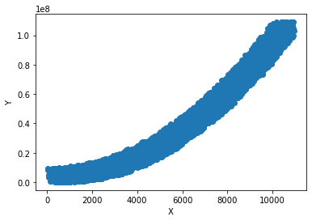
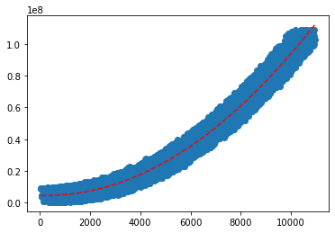
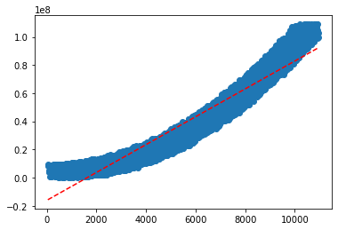

```python
#1: visualize the data

import pandas as pd
from matplotlib import pyplot
from scipy.optimize import curve_fit
from numpy import arange
import numpy as np

y_values = np.array(pd.read_csv('data1.csv')).flatten()
x_values = np.array(pd.read_csv('data2.csv')).flatten()

pyplot.scatter(x_values, y_values)
pyplot.xlabel('X')
pyplot.ylabel('Y')
pyplot.show()
```


​    

​    


```python
#2 define the error analysis
# goodness of fit is measured by R-squared method

def get_error(x_values, y_values, model):
    error = [abs(y_values[i] - model(x_values[i])) for i in range(len(x_values))]
    
    sse = sum(e * e for e in error)
    mean = sum([model(x) for x in x_values]) / len(x_values)
    ssr = sum([(model(x) - mean) ** 2 for x in x_values])
    sst = ssr + sse
    r_squ = ssr / sst
    
    return r_squ
```


```python
#3: define the model, find coefficients and error
# here a quadratic model is used

def quadratic_model(x, a, b, c):
    return b * (x ** 2) + a * x + c

props, _ = curve_fit(quadratic_model, x_values, y_values)
a, b, c = props
print('y = %.3f * x^2 + %.3f * x + %.3f' % (b, a, c))

x_line = arange(min(x_values), max(x_values), 1)
y_line = quadratic_model(x_line, a, b, c)
pyplot.plot(x_line, y_line, '--', color='red')
pyplot.scatter(x_values, y_values)
pyplot.show()

quad_func = lambda x: b * (x ** 2) + a * x + c

print(f'error = {get_error(x_values, y_values, quad_func)}')
```

    y = 0.942 * x^2 + -471.394 * x + 4487339.675



    


    error = 0.9787066262081409


```python
#4: define the model, find coefficients and error
# here a linear model is used

def linear_model(x, a, b):
    return a * x + b

props, _ = curve_fit(linear_model, x_values, y_values)
a, b = props
print('y = %.3f * x + %.3f' % (a, b))

x_line = arange(min(x_values), max(x_values), 1)
y_line = linear_model(x_line, a, b)
pyplot.plot(x_line, y_line, '--', color='red')
pyplot.scatter(x_values, y_values)
pyplot.show()

linear_func = lambda x: a * x + b

print(f'error = {get_error(x_values, y_values, linear_func)}')
```

    y = 9898.475 * x + -16132995.926



    


    error = 0.9204839236296544


## We can see that the error of the linear model(0.9204839236296544) is greater than that of the quadratic model(0.9787066262081409). Hence, the quadratic curve describes the given data more accurately.